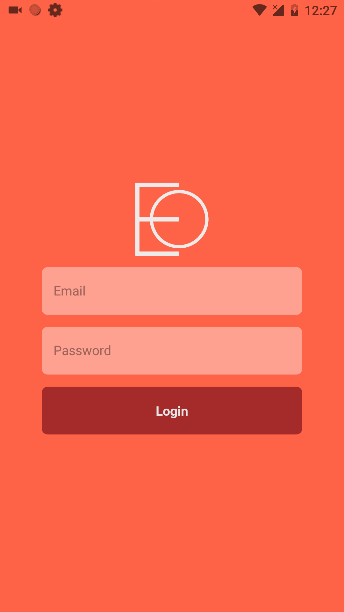
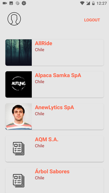
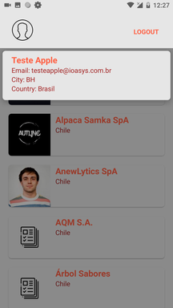
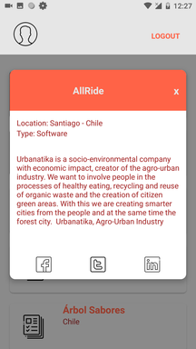
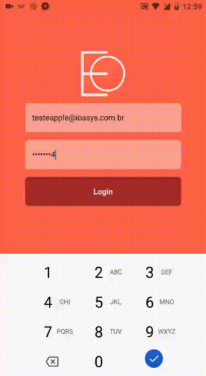
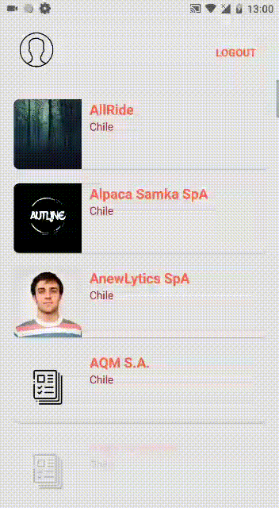

# Desafio React Native - ioasys

### ICONS ####
    

### SCREENSHOTS ###

     

### ANIMATIONS ###

    

### Bibliotecas

* axios
	- Pacote para auxiliar nas requisições web, utilizei por ser mais amigável que o fetch e estar mais habituado ao mesmo.
* prop-types.
	- Pacote para me auxiliar na validação das propriedades dos meus componentes.
* react-navigation
	- Pacote necessária para navegação entre telas.
* react-native-gesture-handler
	- Um helper necessário para auxiliar o react-navigation, sendo necessário o link do mesmo com os projetos nativos do android e iOS.
* redux
	- Pacote que me auxiliou na criação do store global para aplicação o facilitando o acesso aos dados.
* react-redux
	- Para conectar os componentes react ao store redux.
* redux-thunk
	- Auxilia na resolução de promises.
* eslint
	- Utilizei para configurar o meu lint e organizar o meu código.
* babel-eslint
	- Dependencia necessaria para configurar o lint.
* eslint-config-airbnb
	- Pacote com as regras para o meu lint, es2015, a preferência pelo AIRBNB é por utilizar ';'.
* eslint-plugin-react
	- Pacote com as regras para o meu lint, react.
* eslint-plugin-react-native
	- Pacote com as regras para o meu lint, react-native.

### Como testar !?!

- Clique em [Empresas.apk](https://bitbucket.org/tassiomarcos/empresas-react-native/raw/1394620467237d35cae8c77f59a0a9c01c142ee1/Empresas.apk) baixe o arquivo.
- Transfira o arquivo baixado para a memória do smartphone(android).
- Certifique-se que o seu smartphone está habilitado para instalar app de fontes desconhecidas.
- Instale o apk.
